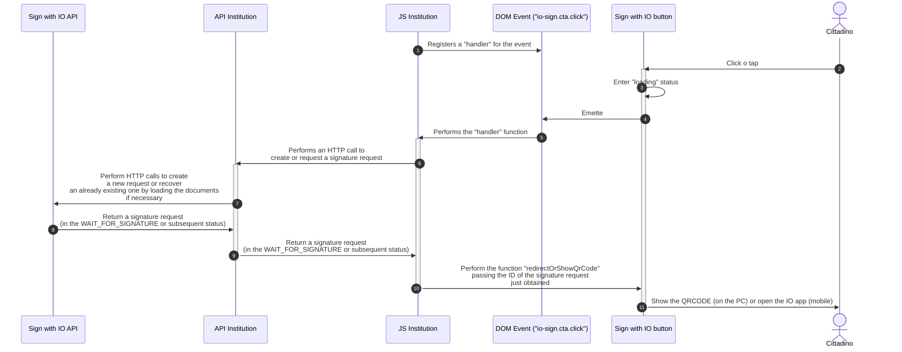

# 🔌 Installation and use

The Sign with IO button is written in JavaScript and is distributed as a [Web Component](https://developer.mozilla.org/en-US/docs/Web/API/Web_components) so it can be integrated in web pages and JavaScript web-apps independently of the JavaScript technologies and frameworks that were used.

Once imported, the component is available on the page as a `custom element` HTML, with the name `io-sign`.

### Include the Sign with IO button

To be able to use the `io-sign` component, it must be included in your HTML pages (in the `<head>` or at the end of `<body>`)

```html
<script type="module" src="https://assets.cdn.io.pagopa.it/sign/io-sign.js"></script>
```

Finally, to show the Sign with IO button on the page, simply declare the HTML element that was just imported in your HTML template or JS component like any other HTML element (`form`, `div`, `video`, ...)

```html
<io-sign></io-sign>
```

### Component function

The Sign with IO button, when clicked or tapped by the citizen, issues an [Event](https://developer.mozilla.org/en-US/docs/Web/API/Event) called `io-sign.cta.click` in the DOM in which it was inserted. Once the event is issued, the component switches to the “loading” status, which informs the user of the start of the flow to create (or obtain) a signature request.

The `loading` status ends when the `redirectOrShowQrCode(signatureRequestId)` method of the element is called, to which the ID of the “Signature request” to be forwarded to the citizen must be passed as the single input parameter.

The element supports the `disabled` HTML attribute (which functions similar to the attribute with the same name present in HTML elements as `input` and `button`), which makes the Sign with IO button non-clickable and stylized so it is seen as deactivated.

Finally, the component exposes the `reset()` function, which cancels “”loading` and resets its status (useful for managing error cases).

#### Example

This example shows how to add the `<io-sign>` element on a page, manage the `io-sign.cta.click` event issued when clicking the Sign with IO button and call the `redirectOrShowQrCode` code to show the QRCode or lead the user directly to the IO app or `reset` to end loading.

In your application inside the function (indicated here) `createOrRetrieveSignatureRequest` you must use all the business logic necessary to create the signature request, obtain one that was already created, upload the documents by dialoguing with your back-end APIs integrated in the Sign with IO REST API.



Summarizing, to engage the citizen with the Sign with IO button on your web page, you must:

1. Include the `io-sign` HTML element on the page
2. Register an `event listener` on the `io-sign.cta.click` event issued by the `io-sign` component
3. Insert your business logic into the event handler that was just registered
4. Call the `redirectOrShowQrCode` function to show the QRCode or redirect the user to the IO app

 For **security** reasons, it is advisable to make the flow for creating the signature request, including the upload of the PDF documents, _exclusively_ in a server to server context (website API to the Sign with IO API) 

 The example of code displayed uses native JavaScript functions, but it is possible to integrate the component also in complex web applications that use libraries/framework such as React, jQuery, Vue, Svelte or Angular. 

### Sequence diagram


